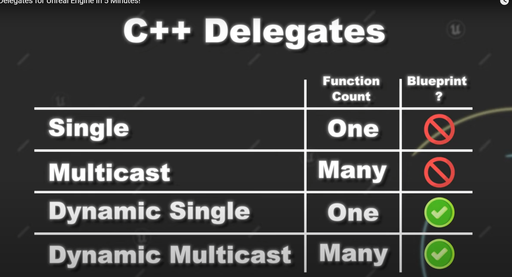
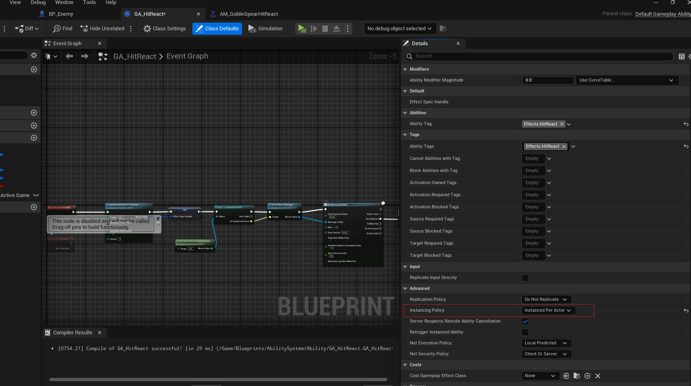

## TODOS
- [ ] TODO 1: USE EffectSpecOpt.GetPtrOrNull() will cause a crash, don't known why
- [ ] diff between aggregated by source and aggregated by target
- [ ] TODO 2: template not working
- [ ] BindAction后面的可变参数好像不能是引用，为什么？
- [ ] TODO 3: remove this for loop
- [ ] MULTI PLAYER CODE
- [ ] BUG 按住发射不松的话会一直发射技能，而且在鼠标的位置
- [x] Blueprint implement event can't not be virtual ? BlueprintImplementableEvent不能在c++中override，所以不需要virtual关键字。如果需要在c++和蓝图中都override，可以使用BlueprintNativeEvent,
而且不需要virtual关键字
- [ ] shift发射火球的方向不是鼠标的方向，会偏移
- [ ] blueprint pure? 没有执行pin的方法，没有副作用（不会改变任何对象的状态），还隐式的包含了BlueprintCallable
- [ ] APlayerController是AController的子类，为什么不能用AController接受APlayerController
- [ ] BUG 火球Destroy时触碰角色触碰到，可能先overlap了，overlap代码执行过程中火球已经销毁了？
- [ ] TODO 4 How to remove this new key

## PROBLEM
- [x] diff between static delegate and dynamic delegate

- [ ] PreAttributesChange Only Change the Current Value of the FGameplayAttributeData?

## Editor Skill
- GA，Instance PerActor，每个Actor只会有一个GA创建

## NOTE
- GAS
 - AttributeSet
 - GameplayEffect
 - GameplayAbility
 - AbilityTask

## PLUS
- 虚血条插值
- 暴击造成敌人血条震动（TODO）
- 敌人行为树(TODO)
