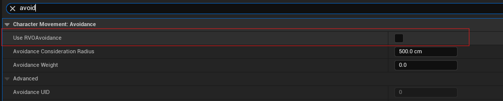

## TODOS
- [ ] TODO 1: USE EffectSpecOpt.GetPtrOrNull() will cause a crash, don't known why
- [ ] diff between aggregated by source and aggregated by target
- [ ] TODO 2: template not working
- [ ] BindAction后面的可变参数好像不能是引用，为什么？
- [ ] TODO 3: remove this for loop
- [ ] MULTI PLAYER CODE
- [ ] BUG 按住发射不松的话会一直发射技能，而且在鼠标的位置
- [x] Blueprint implement event can't not be virtual ? BlueprintImplementableEvent不能在c++中override，所以不需要virtual关键字。如果需要在c++和蓝图中都override，可以使用BlueprintNativeEvent,
而且不需要virtual关键字
- [ ] shift发射火球的方向不是鼠标的方向，会偏移
- [ ] blueprint pure? 没有执行pin的方法，没有副作用（不会改变任何对象的状态），还隐式的包含了BlueprintCallable
- [ ] APlayerController是AController的子类，为什么不能用AController接受APlayerController
- [ ] BUG 火球Destroy时触碰角色触碰到，可能先overlap了，overlap代码执行过程中火球已经销毁了？
- [ ] TODO 4 How to remove this new key
- [ ] BUG 客户端发火球，如果主角和敌人隔得太近，火球在服务器生成-销毁过快，客户端没有得到火球的overlap和Destroy执行
- [ ] TODO 5 这里的Replicate是否合适，是为了修复客户端敌人死后血条往下掉的BUG加上的
- [ ] TODO 6 不返回引用会造成额外复制，但返回引用会闪退，非法内存访问
- [ ] 点脚下发射火球时，motion warping有点问题，应该以人物为原点向点的方向旋转

## PROBLEM
- [x] diff between static delegate and dynamic delegate

- [ ] PreAttributesChange Only Change the Current Value of the FGameplayAttributeData?
- [ ] TObjectPtr有什么好处？
- [ ] diff between MMC and Exec_Calc
- [ ] cancel ability with tag
- [ ] gameplay cue?
- [ ] diff between pawn and character
- [ ] GE中填GameplayCue无法Replicate，可能是虚幻版本问题？而且添加了之后第一次启动游戏触发GE会卡顿

## Editor Skill
- GA，Instance PerActor，每个Actor只会有一个GA创建

- 避免AI角色互相拥挤 (没有strafe blend space的话，角色漂移看起来会不正常)



## NOTE
- GAS
 - AttributeSet
 - GameplayEffect
 - GameplayAbility
 - AbilityTask

- blendspace player, 相当于一个占位符，可以在子类中设置
- call a blueprint native event, Execute_XXX(TargetObj), require for TargetObj is because native event is a static function
```c++
ICombatInterface::Execute_GetCombatSocketLocationExecute_GetCombatSocketLocation(GetAvatarActorFromActorInfo());
```
- UFUNCTION不支持template function
- TMap中不能包含TArray，只能定义一个Struct，Struct中包含Array
- Socket可以用于:
    - attach武器
    - anim montage中timed niagara effect需要socket（eg：攻击trail）
- AbilitySystemComponent->RegisterGameplayTagEvent (eg: Register Gameplay Tag Event (Hit React))

## PLUS
- 虚血条插值
- 暴击造成敌人血条震动（TODO）
- 敌人行为树(TODO)
