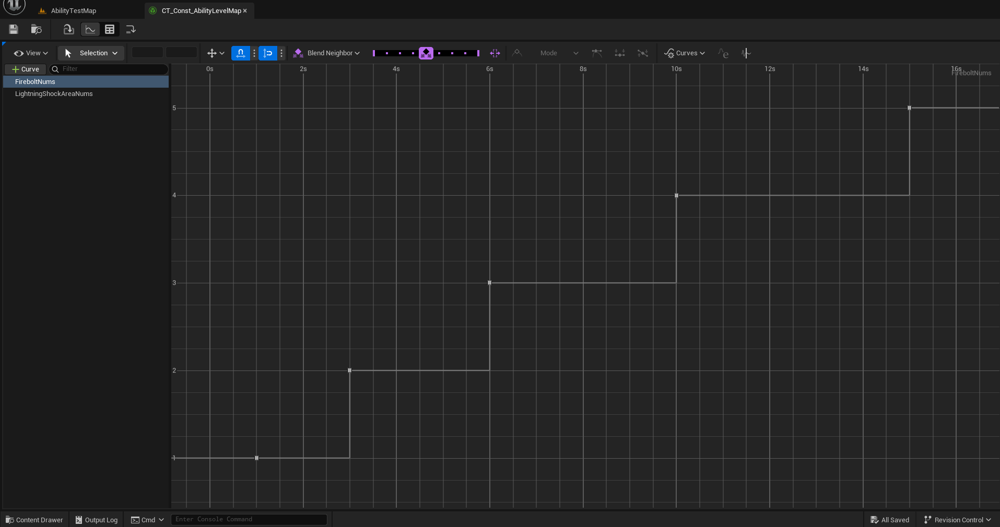
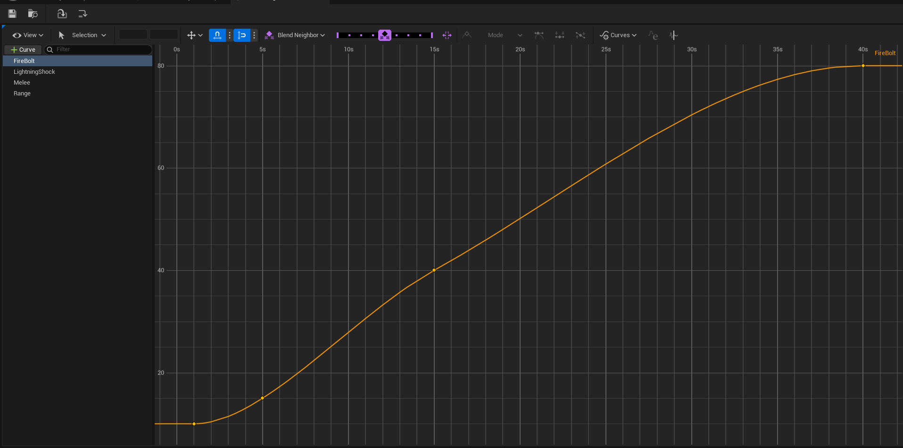
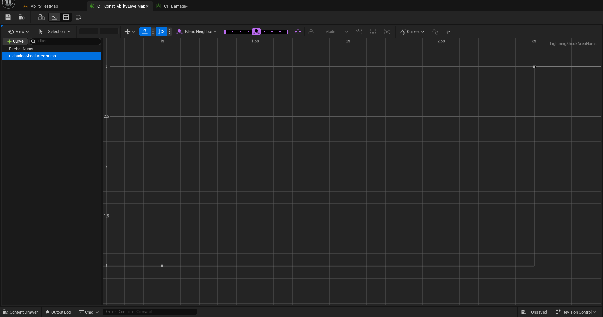
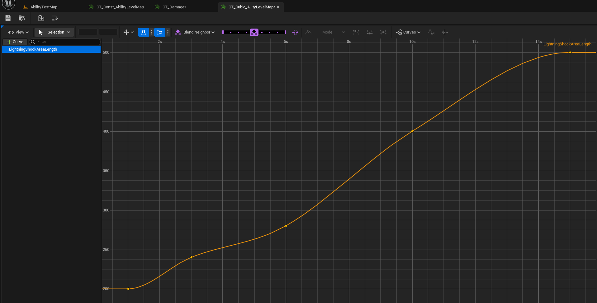
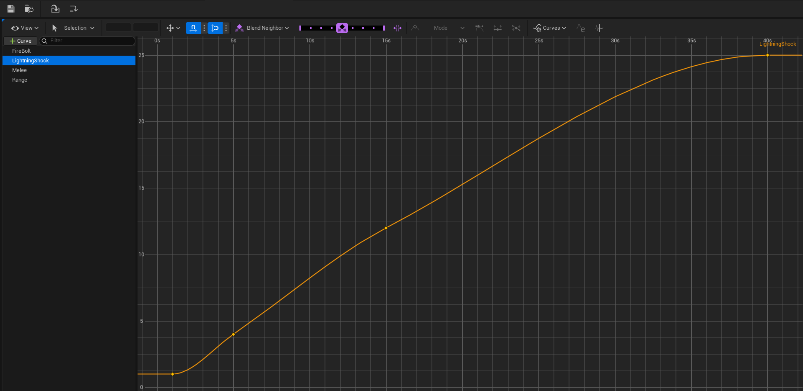
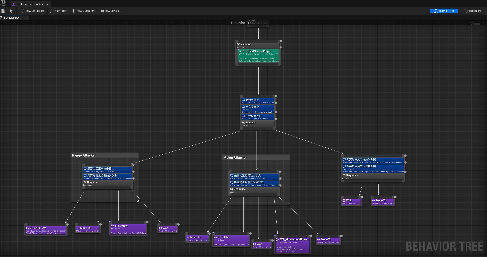
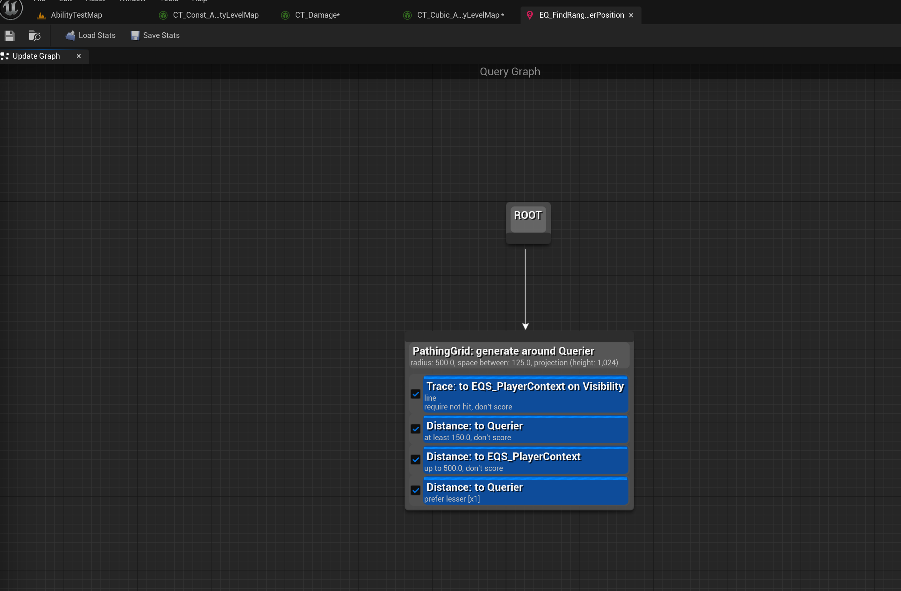

# 演示
<video width="320" height="240" controls>
  <source src="http://ihaveaplanr.com/videos/ls.mp4" type="video/mp4">
</video>
[](https://youtu.be/vt5fpE0bzSY)

# 基础设计
## 数值属性
每个角色都拥有一个AttributeSet属性列表，包括主要主要属性、派生属性和必有属性，其中主要属性可以通过技能点
来升级，由于派生属性都是基于主要属性或其他派生属性计算，所以升级主要属性后相关派生属性也会跟着变化。还有一个
特殊的属性，元属性（Meta Attributes）这个属性不会复制到客户端，只存在于服务器，此类属性用于复杂计算，如伤害，
造成伤害不会直接修改角色血量，而是修改改角色的元属性InComingDamage，然后通过计算护甲、暴击率、抵抗率等变量得出
造成的血量扣减，这个设计可以解耦伤害、叠加值等复杂计算的代码，提升代码复用率。


### 主要属性
- 力量: 影响基础攻击伤害
- 智力: 影响魔力上限
- 抵抗: 基础抵抗属性，会造成伤害减免
- 活力: 影响血量上限
### 派生属性
- 护甲: 提升伤害减免
- 抵挡率: 有几率减半伤害
- 暴击率: 有几率造成双倍伤害
- 最大血量
- 最大魔力
- 火焰抵抗: 火焰伤害减免 
- 雷电抵抗: 雷电伤害减免
- 物理抵抗: 物理伤害减免
- 最大火焰叠加: 火焰叠加值满后角色会着火并持续扣减血量
- 最大雷电叠加: 雷电叠加值满后角色会眩晕
### 必有属性
- 血量
- 魔力
- 火焰叠加
- 雷电叠加
- 经验值
- 最大经验值: 达到最大经验值角色升级
- 等级: 角色等级
- 技能点: 升级后获取技能点，可以用于提升主要属性等级和技能等级

#### 火焰和雷电叠加值演示
<video width="320" height="240" controls>
  <source src="https://wenhaoxiong.oss-cn-beijing.aliyuncs.com/%E5%8F%A0%E5%8A%A0%E5%80%BC%E6%BC%94%E7%A4%BA.mp4?Expires=1754229940&OSSAccessKeyId=TMP.3Ks8uQuoQytaMhFk5DdRgPtdzN1ShsnJkxnrLqk9M2PWzQEQi6oMu5wfJXNmRJDBH1NeheGCVY33hSWsG9qM46Sj4pAmvH&Signature=%2FJa6LzhcnXADiZwh9tlr7Er1CZM%3D" type="video/mp4">
</video>

### 元属性
通过元属性设计解耦复杂计算，这里演示了三个元属性的复杂计算。
```c++
    // 是否为环境伤害或叠加伤害效果，如果是，不计算暴击伤害、防御伤害
    bool bEnvDamage =
        Spec.Def->GetAssetTags()
        // .GetDynamicAssetTags()
        .HasTagExact(FDefaultGameplayTags::Get().Effect_EnvDamage);
    bool bStackingDamage =
        Spec.Def->GetAssetTags()
        .HasTagExact(FDefaultGameplayTags::Get().Effect_StackingDamage);
    bool bIgnoreCritAndBlock { bEnvDamage || bStackingDamage };

    float Damage { 0.f };

    for (const auto& [DamageTypeTag, ResistanceTypeTag] : FDefaultGameplayTags::Get().DamageTypeAndResistanceMap) {
        // 如果为环境伤害且角色拥有叠加伤害触发状态，忽略此类型伤害
        auto DamageTypeAndStackingTriggeredMap = FDefaultGameplayTags::Get().DamageTypeAndStackingTriggeredMap;
        if (bEnvDamage && 
            DamageTypeAndStackingTriggeredMap.Contains(DamageTypeTag) && 
            TargetASC->HasMatchingGameplayTag(DamageTypeAndStackingTriggeredMap[DamageTypeTag])) {
            continue;
        }

        float Resistance { 0.f };

        // Get Set By Caller
        float DamageVal = Spec.GetSetByCallerMagnitude(DamageTypeTag);

        ExecutionParams.AttemptCalculateCapturedAttributeMagnitude(
            DamageStatics().TagsToCaptureDefMap[ResistanceTypeTag],
            EvaluationParameters, Resistance);

        Resistance = FMath::Clamp(Resistance, 0.f, 100.f);

        DamageVal *= ( 100.f - Resistance ) / 100.f;
        Damage += DamageVal;
    }

    float Armor { 0.f };
    float BlockChance { 0.f };
    float ArmorPenetration { 0.f };
    float CriticalHitChance { 0.f };
    ExecutionParams.AttemptCalculateCapturedAttributeMagnitude(DamageStatics().ArmorDef, EvaluationParameters, Armor);
    ExecutionParams.AttemptCalculateCapturedAttributeMagnitude(DamageStatics().BlockChanceDef, EvaluationParameters, BlockChance);
    ExecutionParams.AttemptCalculateCapturedAttributeMagnitude(DamageStatics().ArmorPenetrationDef, EvaluationParameters, ArmorPenetration);
    ExecutionParams.AttemptCalculateCapturedAttributeMagnitude(DamageStatics().CriticalHitChanceDef, EvaluationParameters, CriticalHitChance);
    Armor = FMath::Max<float>(0.f, Armor);
    BlockChance = FMath::Max<float>(0.f, BlockChance);
    ArmorPenetration = FMath::Max<float>(0.f, ArmorPenetration);


    // 是否触发防御
    bool bBlocked = !bIgnoreCritAndBlock && FMath::RandRange(1, 100) <= BlockChance;
    if (bBlocked) {
        Damage /= 2.f;
    }

    // 护甲减伤、暴击
    auto CharacterClassInfo = UDefaultAbilitySystemLibrary::GetCharacterClassInfo(SourceAvatarActor);
    auto DamageCalcCoefficientsCT = CharacterClassInfo->DamageCalcCoefficientsCT;
    const auto ArmorPenetrationCurve = DamageCalcCoefficientsCT->FindCurve("ArmorPenetrationCoefficient", FString());
    const auto EffectiveArmorCurve = DamageCalcCoefficientsCT->FindCurve("EffectiveArmorCoefficient", FString());
    const auto CriticalHitCurve = DamageCalcCoefficientsCT->FindCurve("CriticalHitCoefficient", FString());
    
    const auto ArmorPenetrationCoefficient = ArmorPenetrationCurve->Eval(SourceCombatInterface->GetPlayerLevel());
    const auto EffectiveArmorCoefficient = EffectiveArmorCurve->Eval(TargetCombatInterface->GetPlayerLevel());
    const auto CriticalCoefficient = CriticalHitCurve->Eval(SourceCombatInterface->GetPlayerLevel());


    if (!bIgnoreCritAndBlock) {
        float EffectiveArmor = Armor * (100.f - ArmorPenetration * ArmorPenetrationCoefficient) / 100.f;
        Damage *= (100.f - EffectiveArmor * EffectiveArmorCoefficient) / 100.f;
    }

    bool bCriticalHit = !bIgnoreCritAndBlock && FMath::RandRange(1, 100) <= CriticalHitChance;
    if (bCriticalHit) {
        Damage *= 2 * CriticalCoefficient; 
    }


    // Set Custom ContextHandle
    FGameplayEffectContextHandle Context = Spec.GetContext();
    UDefaultAbilitySystemLibrary::SetIsBlockedHit(Context, bBlocked);
    UDefaultAbilitySystemLibrary::SetIsCriticalHit(Context, bCriticalHit);

    // Damage Modifier
    FGameplayModifierEvaluatedData EvaluatedData { UDefaultAttributeSet::GetIncomingDamageAttribute(), EGameplayModOp::Additive, Damage };
    OutExecutionOutput.AddOutputModifier(EvaluatedData);

    // Stacking Modifier
    for (const auto& Pair : FDefaultGameplayTags::Get().StackingTypeAndTriggeredMap) {
        float StackingVal { Spec.GetSetByCallerMagnitude(Pair.Key) };
        if (TargetASC->HasMatchingGameplayTag(Pair.Value)) {
            StackingVal = 0.f;
        }

        FGameplayModifierEvaluatedData EvaluatedDataStacking { TargetAS->StackingTagAttributeMap[Pair.Key], EGameplayModOp::Additive, StackingVal };
        OutExecutionOutput.AddOutputModifier(EvaluatedDataStacking);
    }
```
- IncomgingDamage: 计算暴击、抵挡、护甲和各种属性的抵抗。如物理抵抗减免物理伤害
- IncomingFireStacking: 不计算暴击、抵挡、护甲。只计算火焰抵抗
- IncomingLightningStacking: 不计算暴击、抵挡、护甲。只计算雷电抵抗

## 技能
### 火球术
#### 技能演示
技能生成一个或多个Projectile（飞行物组件），通过HomingTarget实现追踪敌人的效果。如果生成多个飞行物，会计算每个飞行物的射出方向
<video width="320" height="240" controls>
  <source src="https://wenhaoxiong.oss-cn-beijing.aliyuncs.com/%E7%81%AB%E7%90%83%E6%BC%94%E7%A4%BA.mp4?Expires=1754229977&OSSAccessKeyId=TMP.3Ks8uQuoQytaMhFk5DdRgPtdzN1ShsnJkxnrLqk9M2PWzQEQi6oMu5wfJXNmRJDBH1NeheGCVY33hSWsG9qM46Sj4pAmvH&Signature=UBWzABIiorRCEiZt%2FKy16B9Ds6c%3D" type="video/mp4">
</video>
#### 技能属性
火球数量: 1-2级1个，3-5级2个，6-9级四个


火球伤害，伤害表：


### 雷击
#### 技能演示
技能射出一个或多个雷电束，敌人在范围内会造成雷电伤害和雷电叠加伤害，叠加伤害叠满后造成眩晕效果。技能可以通过按住持续释放，松开按键
进入节能冷却。魔力消耗分为两段，初始消耗和持续消耗，释放技能必定扣减初始消耗，持续释放技能会根据时间扣减魔力值
<video width="320" height="240" controls>
  <source src="https://wenhaoxiong.oss-cn-beijing.aliyuncs.com/%E9%9B%B7%E5%87%BB%E6%BC%94%E7%A4%BA.mp4?Expires=1754229998&OSSAccessKeyId=TMP.3Ks8uQuoQytaMhFk5DdRgPtdzN1ShsnJkxnrLqk9M2PWzQEQi6oMu5wfJXNmRJDBH1NeheGCVY33hSWsG9qM46Sj4pAmvH&Signature=i5V4IrfxGcovyMs00ISLV74Ez7Y%3D" type="video/mp4">
</video>
#### 技能属性
雷电束数量： 1-2级1束，3级以上3束

雷电束长度表：

伤害表：


# 敌人AI
## 行为树
近战敌人和远程敌人拥有不同的行为模式，近战敌人靠近目标后攻击，然后随机在目标周围移动后再次发动攻击。
远程敌人会于目标保持距离，并且会绕过掩体攻击目标


## EQS环境感知
远程类型敌人会根据EQS感知周围的环境并绕过障碍物攻击主角
<video width="320" height="240" controls>
  <source src="https://wenhaoxiong.oss-cn-beijing.aliyuncs.com/%E8%BF%9C%E7%A8%8B%E6%95%8C%E4%BA%BAAI%E6%BC%94%E7%A4%BA.mp4?Expires=1754230016&OSSAccessKeyId=TMP.3Ks8uQuoQytaMhFk5DdRgPtdzN1ShsnJkxnrLqk9M2PWzQEQi6oMu5wfJXNmRJDBH1NeheGCVY33hSWsG9qM46Sj4pAmvH&Signature=s%2BJKOlaxQGavUvQ5RyyZwmsKL2o%3D" type="video/mp4">
</video>


