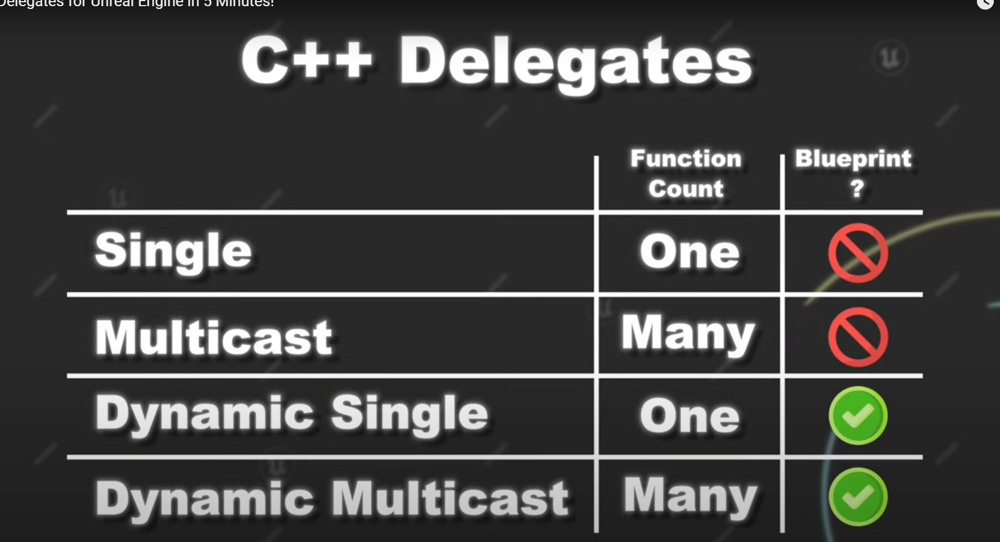
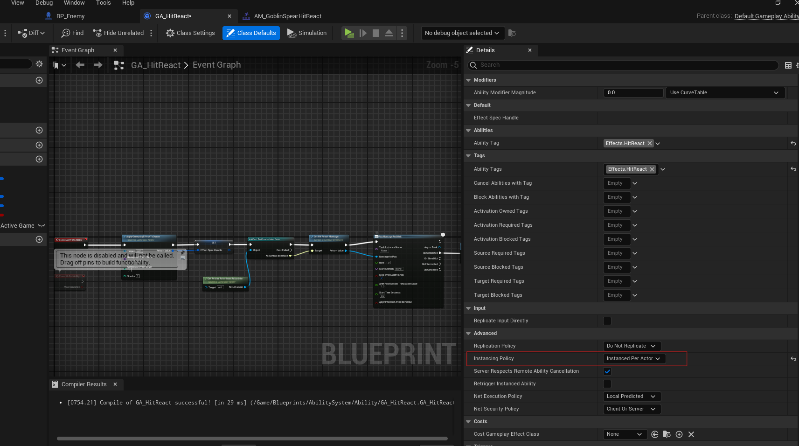
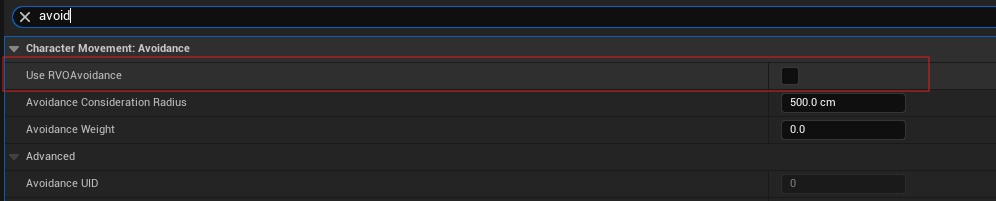

## TODOS
- [ ] TODO 1: USE EffectSpecOpt.GetPtrOrNull() will cause a crash, don't known why
- [ ] diff between aggregated by source and aggregated by target
- [ ] TODO 2: template not working
- [ ] BindAction后面的可变参数好像不能是引用，为什么？
- [ ] TODO 3: remove this for loop
- [ ] MULTI PLAYER CODE
- [ ] BUG 按住发射不松的话会一直发射技能，而且在鼠标的位置
- [x] Blueprint implement event can't not be virtual ? BlueprintImplementableEvent不能在c++中override，所以不需要virtual关键字。如果需要在c++和蓝图中都override，可以使用BlueprintNativeEvent,
而且不需要virtual关键字
- [ ] shift发射火球的方向不是鼠标的方向，会偏移
- [ ] blueprint pure? 没有执行pin的方法，没有副作用（不会改变任何对象的状态），还隐式的包含了BlueprintCallable
- [x] APlayerController是AController的子类，为什么不能用AController接受APlayerController （代码错误，头文件中没有包含Controller.h，所以编译器不认识AController类）
- [ ] BUG 火球Destroy时触碰角色触碰到，可能先overlap了，overlap代码执行过程中火球已经销毁了？
- [ ] TODO 4 How to remove this new key
- [ ] BUG 客户端发火球，如果主角和敌人隔得太近，火球在服务器生成-销毁过快，客户端没有得到火球的overlap和Destroy执行
- [ ] TODO 5 这里的Replicate是否合适，是为了修复客户端敌人死后血条往下掉的BUG加上的
- [ ] TODO 6 不返回引用会造成额外复制，但返回引用会闪退，非法内存访问
- [ ] 点脚下发射火球时，motion warping有点问题，应该以人物为原点向点的方向旋转
- [ ] BUG，网络有延迟的情况下，客户端火球有时候发不出来
- [ ] WaitCooldown.cpp需要参考GasDocument项目的预测写法
- [ ] 设计火、雷等等叠加属性，属性到100就触发着火、雷电等效果。收到火焰伤害或者在火堆中都会叠加这个值.
如果角色已经着火，清空叠加属性值，而且在着火期间不会叠加值
- [ ] TODO StackingAttribute随时间减少
- [ ] TODO BUG FIX(Effect Actor的Effect预测导致) LogAbilitySystem: Warning: RemoveActiveGameplayEffect called without Authority when attempting to remove None. Fix-up code, or temporarily patch using AbilitySystem.Fix.AllowPredictiveGEFlags
- [ ] 手柄和键盘的兼容，目前LightningShock还没有MotionWarping; 翻译; 被动技能（随时间减Stacking Value） 
- [ ] 能力升级 Lightning Shock每升一级可以自动连接最近的一个敌人
- [ ] Health/Mana Crystal的持续恢复效果，目前是用插值算法来跟随角色，是否还可以用行为树使它更真实一点。（目前如果角色一直移动，效果是追不上角色的，想要角色突然移动效果延迟一段时间开始，并且角色一直移动效果可以在加速后追上角色）
- [x] 完成拾取物品的动画
- [x] 没有蓝量LightningShock需要立即结束、攻击命中动画能不能复用
- [ ] LightningShock对敌人的伤害没有显示
- [ ] 实现经验条和升级, 升级后文字提示
- [ ] 开始游戏界面和载入界面
- [ ] 升级后最大血量没有改变
- [ ] stacking值为0后，infinite effect还在一直执行

## PROBLEM
- [x] diff between static delegate and dynamic delegate

- [ ] PreAttributesChange Only Change the Current Value of the FGameplayAttributeData?
- [ ] TObjectPtr有什么好处？
- [x] diff between MMC and Exec_Calc (MMC只能改变一个Attribute，他们都可以捕获多个Attribute)
- [x] cancel ability with tag (当启动当前能里会取消这个tag关联的能力)
- [x] gameplay cue (GasDocument)
- [ ] diff between pawn and character
- [ ] GE中填GameplayCue无法Replicate，可能是虚幻版本问题？而且添加了之后第一次启动游戏触发GE会卡顿
- [ ] MarkAsDirty() ?
- [ ] Ability Batching
- [ ] how to set actor relevancy range ()
- [ ] EffectActor的EndOverlap已经绑定到Server了，但是执行多人游戏依然会在客户端执行，是因为Prediction吗？
- [ ] 如果一个类中包含一个UniquePtr，拷贝这个类的时候，ptr会完全拷贝吗？
- [ ] c++子类可以在构造器的初始化列表中显示调用父类构造器，如果不指定会隐式调用父类构造器吗？

## Editor Skill
- GA，Instance PerActor，每个Actor只会有一个GA创建

- 避免AI角色互相拥挤 (没有strafe blend space的话，角色漂移看起来会不正常)



## NOTE
- GAS
 - AttributeSet
 - GameplayEffect
 - GameplayAbility
 - AbilityTask

- blendspace player, 相当于一个占位符，可以在子类中设置
- call a blueprint native event, Execute_XXX(TargetObj), require for TargetObj is because native event is a static function
```c++
ICombatInterface::Execute_GetCombatSocketLocationExecute_GetCombatSocketLocation(GetAvatarActorFromActorInfo());
```
- UFUNCTION不支持template function
- TMap中不能包含TArray，只能定义一个Struct，Struct中包含Array
- Socket可以用于:
    - attach武器
    - anim montage中timed niagara effect需要socket（eg：攻击trail）
- AbilitySystemComponent->RegisterGameplayTagEvent (eg: Register Gameplay Tag Event (Hit React))
- If you get the error message LogAbilitySystem: Warning: Can't activate LocalOnly or LocalPredicted ability %s when not local! then you did not initialize your ASC on the client.

## PLUS
- 虚血条插值
- 暴击造成敌人血条震动（TODO）
- 敌人行为树(TODO)
